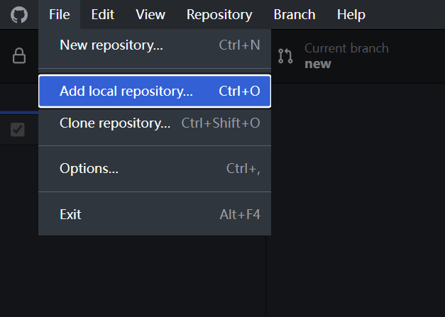
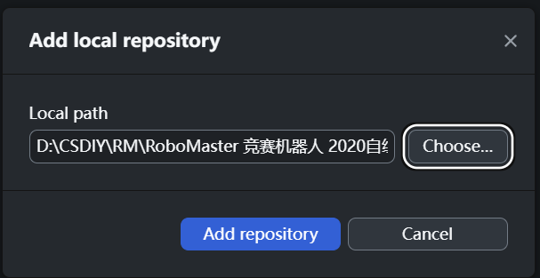
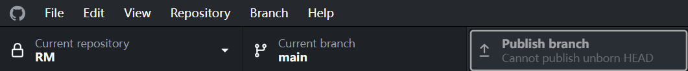
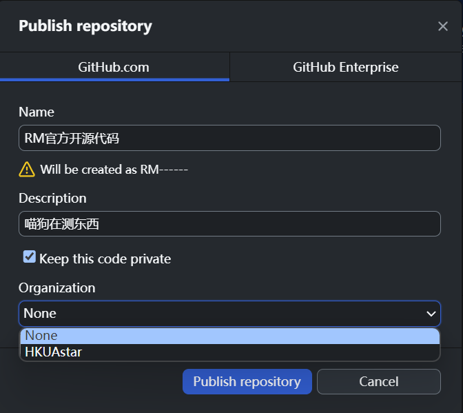

# 嵌入式组Github使用指南
20240125 Init \
[参考链接](https://blog.csdn.net/zhzht19861011/article/details/109983129)
## 前言
单片机烧录使用的是二进制file。
KEIL编译后会出现`.hex` `.o` 等文件，使用github如果直接`add .`把当前文件夹整个扔上去，merge branch时会出现一大堆conflict。 \
解决方案：添加`.gitignore`文件后可直接`add .`。
## `.gitignore`
**以下摘选自参考链接** 

只需要关注 **文件后缀** ,**嫌麻烦可以跳过不看直接把提供的`.gitignore`文件放在根目录下**，在出现merge conflict的时候对照该表查看哪些必须予以重视
#### 需要版本控制的工程文件
在设置工作流之前，项目经理要绝对清楚哪些文件需要版本控制。除了所有源代码需要版本控制外，uVision的一些特殊文件也要进行监控。

- 所有用户源文件（*.c、*.cpp、*.h、*.inc、*.s、*.txt）

- 工程文件：`Project.uvprojx`（用于构建项目）

- 工程选项文件：`Project.uvoptx`（保存调试器和跟踪配置信息）

- 用于多个工程工作区的工程文件：`Project.uvmpw`

- 复制到工程中的运行时环境配置文件（.\**RTE文件夹**下的所有文件）

- RTE：MDK5.0之后运行时环境，主要有外设驱动、操作系统、库和协议栈。

- 由软件组件创建的#include列表：RTE\RTE_Components.h文件

- 设备配置文件，比如：RTE\Device\LPC1857\RTE_Device.h

  - [Meowoof: `.c` `.h`文件全部留下]

- 链接控制文件（`Project.sct`，如果手动创建的话）

- 所有相关Pack文件（比如ARM::`CMSIS`）

#### 不需要监控的文件
- 工程页面布局文件：`Project.uvguix.username`

- 在.\Listings和.\Objects文件夹中产生的输出文件

- 用于调试适配器的INI文件

### `.gitignore` 指南

在上面列举出了不需要监控的文件，这里介绍如何忽略这些文件。

在工作区根目录下创建一个特殊的``.gitignore`文件，然后把要忽略的文件名填进去，Git就会自动忽略这些文件。

文件 ``.gitignore` 的格式规范如下：

所有空行或者以 # 开头的行都会被 Git 忽略。

可以使用标准的 glob 模式匹配，它会递归地应用在整个工作区中。

匹配模式可以以（/）开头防止递归。

匹配模式可以以（/）结尾指定目录。

要忽略指定模式以外的文件或目录，可以在模式前加上叹号（!）取反。

**不懂的，重修ENGG1340 或者 求GOOGLE**

## 版本控制 Version Control
不用翻墙当然用github啦

### 手把手创建github repo
拿到文件，解压，扔进vscode

`git init`

把`.gitignore`扔进根目录！！！！！

`git add .` 把根目录中所有文件都track了，git会自动根据`.gitignore`选择性忽略一些无需进行版本管理的文件

`git commit -m "Init"`commit a message called "Init"

为了保证HEAD有东西，这样才能创建git repo

蠢方法：打开GitHub Desktop并登录

点击publish branch。如果图中显示没有HEAD，是因为没有做以上步骤。

弹窗，给repo取个名字吧

然后就可以在github看到刚刚创建的repo了

### 工作流程 workflow
Mewoof:不知道怎么说呢交给zsy补全我写的不一定对

`git pull` 确保everything up to date

`git branch` 查看已有分支

`git branch [branchname]` 创一个自己的分支

~~修改屎山~~认真撸码，别忘了时不时commit一下 `git commit -m "[message]"`

`git push` 下班后把东西扔上github

### 代码越来越屎想回原来的版本怎么办
首先，请 **确保自己commit的message认认真真写好了**,否则在追溯版本过程中你就要对着一堆“miao” “.,.,” “yyds” 这种无厘头message思考人生

`git log` 查看commit日志,记住需要的commit版本 **前六个数字/字母**

